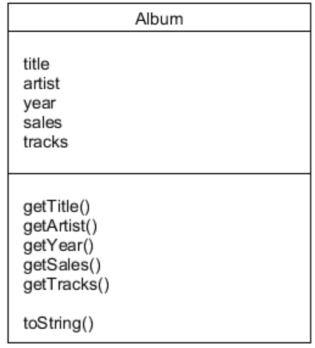
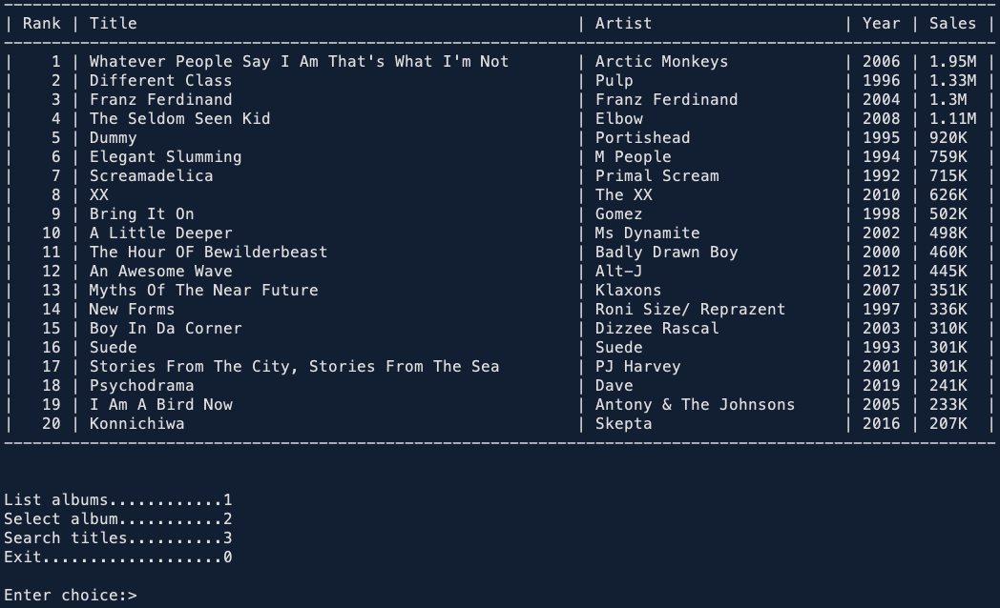
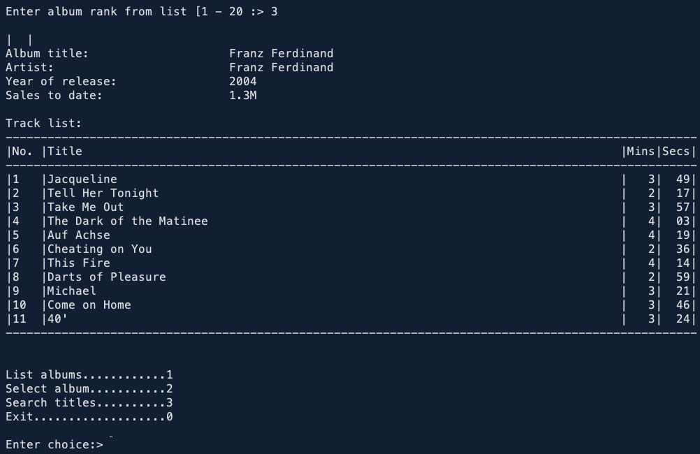
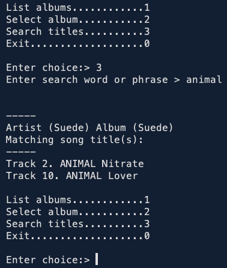

# Album-Rankings-System
 **Object Oriented Programming Coursework, Second Year of Computer Science**
 1. The program parses the data file, create an object for each album, and store all the objects into a suitable collection.

   Below is a partial UML class of the project

   

 2. Program presents the User with a console-based menu to interact with the data set.
   This menu will loop until the User enters a character to exit the menu (e.g. as illustrated below)

   

 3. The User can simply exit the program by entering zero. The three other menu options allow the User to inspect the information in the data set (note again that this program is entirely read-only and there was no requirement to add, update or delete any part of the data set).

   Below are images of the necessary interactions of the program with respect to the options mentioned above.

 - &emsp; Listing the albums

   &emsp;&emsp; 

 - &emsp; Selecting an album

   &emsp;&emsp; 

 - &emsp; Search a title

   &emsp;&emsp; 
